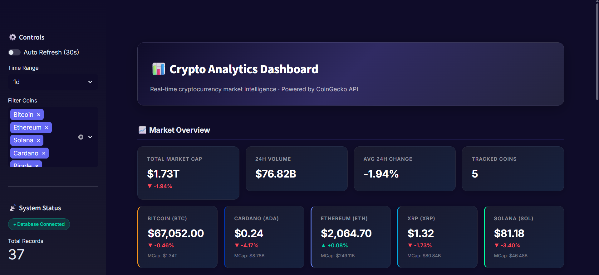
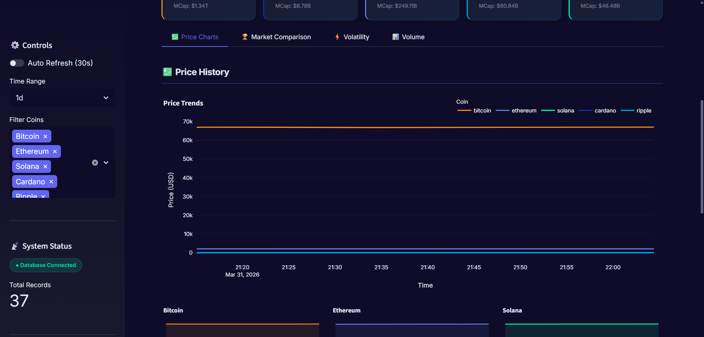
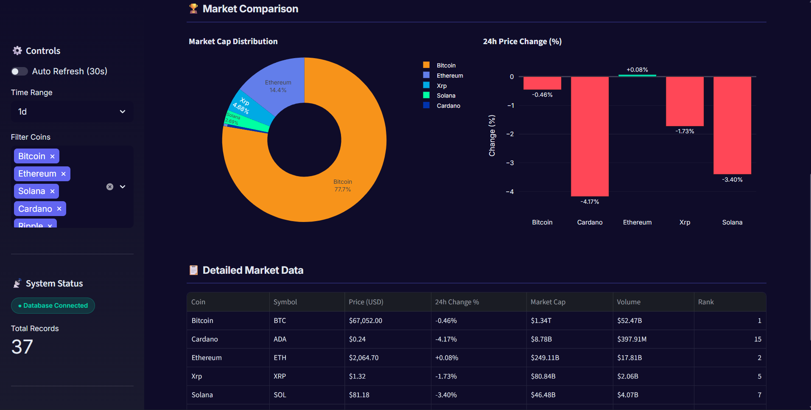
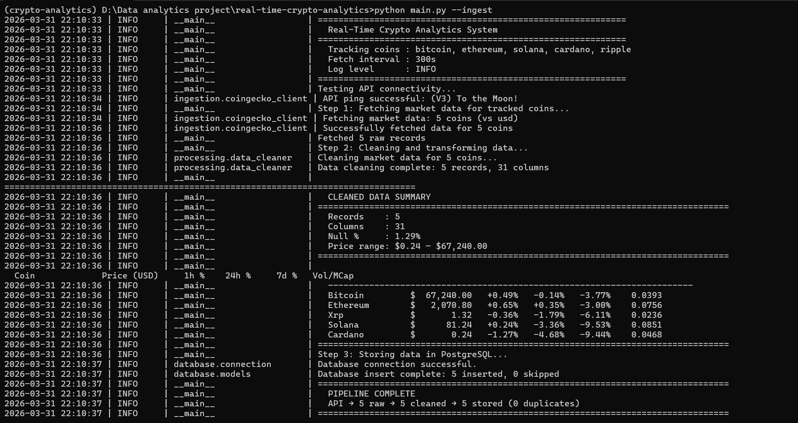

# 🚀 Real-Time Crypto Analytics System

A production-ready real-time data analytics system that ingests cryptocurrency market data from the CoinGecko API, processes and stores it in PostgreSQL, and visualizes actionable insights through an interactive Streamlit dashboard.


## 📋 Table of Contents

- [Overview](#overview)
- [Architecture](#architecture)
- [Tech Stack](#tech-stack)
- [Project Structure](#project-structure)
- [Setup & Installation](#setup--installation)
- [Configuration](#configuration)
- [Usage](#usage)
- [Deployment](#deployment)
- [Screenshots](#screenshots)

## 🔍 Overview

This system provides end-to-end cryptocurrency market analytics by:

- **Ingesting** real-time data from CoinGecko API (1–5 min intervals)
- **Processing** raw data through cleaning and transformation pipelines
- **Storing** time-series data efficiently in PostgreSQL
- **Analyzing** market trends via SQL-powered analytics queries
- **Visualizing** KPIs and insights through an interactive dashboard
- **Deploying** the complete system on Render for public access

## 🏗️ Architecture

```
┌──────────────┐     ┌──────────────────┐     ┌──────────────┐
│  CoinGecko   │────▶│  Data Ingestion  │────▶│    Data      │
│     API      │     │     Layer        │     │  Processing  │
└──────────────┘     └──────────────────┘     └──────┬───────┘
                                                     │
                                                     ▼
┌──────────────┐     ┌──────────────────┐     ┌──────────────┐
│  Streamlit   │◀────│   Analytics      │◀────│  PostgreSQL  │
│  Dashboard   │     │     Layer        │     │   Database   │
└──────────────┘     └──────────────────┘     └──────────────┘
```

## 🛠️ Tech Stack

| Component         | Technology               |
|-------------------|--------------------------|
| Programming       | Python 3.10+             |
| Data Processing   | Pandas, NumPy            |
| Database          | PostgreSQL               |
| ORM               | SQLAlchemy               |
| API Handling      | Requests                 |
| Visualization     | Streamlit                |
| Scheduling        | APScheduler / Cron       |
| Deployment        | Render                   |
| Environment       | Conda                    |
| Version Control   | Git & GitHub             |

## 📁 Project Structure

```
real-time-crypto-analytics/
├── config/
│   ├── __init__.py
│   └── settings.py              # Configuration & environment variables
├── ingestion/
│   ├── __init__.py
│   └── coingecko_client.py      # CoinGecko API client with rate limiting
├── processing/
│   ├── __init__.py
│   └── data_cleaner.py          # Data cleaning & transformation pipeline
├── database/
│   ├── __init__.py
│   ├── models.py                # SQLAlchemy ORM models
│   ├── connection.py            # Database connection manager
│   └── queries.py               # Analytics SQL queries
├── dashboard/
│   ├── __init__.py
│   └── app.py                   # Streamlit dashboard application
├── scheduler/
│   ├── __init__.py
│   └── jobs.py                  # APScheduler automated ingestion
├── tests/
│   ├── __init__.py
│   ├── test_ingestion.py
│   ├── test_processing.py
│   └── test_database.py
├── screenshots/                  # Dashboard screenshots
├── .streamlit/
│   └── config.toml              # Streamlit theme configuration
├── .env.example                  # Environment variables template
├── .gitignore                    # Git ignore rules
├── environment.yml               # Conda environment file
├── requirements.txt              # pip dependencies
├── Procfile                      # Render deployment config
├── build.sh                      # Render build script
├── main.py                       # Application entry point
└── README.md                     # Project documentation
```

## ⚙️ Setup & Installation

### Prerequisites

- Python 3.10+
- PostgreSQL 15+
- Conda (Miniconda or Anaconda)
- Git

### 1. Clone the Repository

```bash
git clone https://github.com/<your-username>/real-time-crypto-analytics.git
cd real-time-crypto-analytics
```

### 2. Create Conda Environment

```bash
conda env create -f environment.yml
conda activate crypto-analytics
```

### 3. Configure Environment Variables

```bash
cp .env.example .env
# Edit .env with your database credentials
```

### 4. Initialize Database

```bash
python main.py --init-db
```

### 5. Run the Application

```bash
# Single data ingestion cycle
python main.py --ingest

# Start automated pipeline (every 5 min)
python main.py --schedule

# Launch dashboard (separate terminal)
streamlit run dashboard/app.py
```

## 🔧 Configuration

All configuration is managed via environment variables. See `.env.example` for available options:

| Variable         | Description                    | Default              |
|------------------|--------------------------------|----------------------|
| `DATABASE_URL`   | PostgreSQL connection string   | `postgresql://...`   |
| `API_BASE_URL`   | CoinGecko API base URL         | `https://api.coingecko.com/api/v3` |
| `FETCH_INTERVAL` | Data fetch interval (seconds)  | `300`                |
| `COINS`          | Comma-separated coin IDs       | `bitcoin,ethereum,...`|
| `LOG_LEVEL`      | Logging level                  | `INFO`               |

## 🖥️ Usage

### Running the Full System Locally

Open **two terminal windows**:

**Terminal 1 — Data Pipeline (keep running):**
```bash
conda activate crypto-analytics
python main.py --schedule
```

**Terminal 2 — Dashboard:**
```bash
conda activate crypto-analytics
streamlit run dashboard/app.py
```

### CLI Commands

| Command | Description |
|---|---|
| `python main.py --init-db` | Create database tables |
| `python main.py --ingest` | Run one ingestion cycle |
| `python main.py --schedule` | Start automated pipeline |
| `python main.py --dashboard` | Launch Streamlit dashboard |

## 🚀 Deployment on Render

### Architecture for Deployment

```
Render Web Service (Dashboard)  ←→  Render PostgreSQL (Cloud DB)
         ↑                                    ↑
    Streamlit App                    Render Cron Job (Scheduler)
                                    fetches data every 5 min
```

> **Note:** On Render, a cloud PostgreSQL database is used instead of localhost.

### Step-by-Step Deployment Guide

See detailed deployment instructions below in the **Deployment** section.

## 📸 Screenshots

### Dashboard Overview


### Price Charts


### Market Comparison


### Pipeline Output


> **To add screenshots:** Save your screenshots as `.png` files in the `screenshots/` folder with the names shown above.

## 📄 License

This project is licensed under the MIT License.

